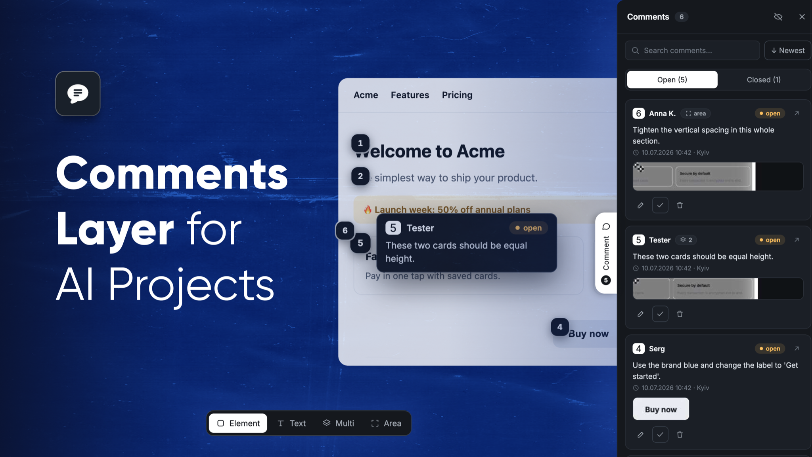

# CommentLayer



### ▶ [Try the live demo](https://commentlayer-demo.vercel.app)

Pull the **Comment** tab on the right, click any element, and leave a note — no signup.

**Figma-style review comments for live web UIs.** Drop one script into any page, click
an element, and leave a pinned comment. A comment is a *change request*: when the UI is
regenerated, comments on rewritten regions **auto-resolve** and move to history — comments
on untouched regions carry forward to the new version.

Framework-agnostic, isolated in a Shadow DOM (never collides with the host app's styles),
and self-hosted on your own database. Nothing phones home.

## Highlights

- **Diff-driven auto-resolve** — comments resolve themselves when their region is rewritten, and carry forward when it isn't. The thing no feedback tool and no AI builder does.
- **Click to comment** on any element — plus **Text** (a phrase), **Multi** (several elements → one comment) and **Area** (drag a region).
- **Pins with hover previews**, two-way pin ↔ card highlight, stable never-reused numbers.
- **Element screenshots** — every comment stores a thumbnail of what it looked like.
- **Multi-user + realtime** via Supabase, or zero-backend **localStorage** for a quick solo try.
- **Review panel** — search, sort, Open/Closed tabs, resolve / reopen / delete, inline edit, keyboard shortcuts (`C` comment · `P` panel · `H` hide pins · `Esc` back out).
- **Works on touch** — on phones a bottom-right button arms commenting and the panel becomes a full-screen sheet, so the page underneath stays fully usable.

## Quick start (self-hosted, ~10 min)

CommentLayer runs on **your** origin with **your** database — no mixed-content/CORS issue,
and your data stays yours.

**1. Install**

```bash
npx github:neodisa/CommentLayer public/comment-layer
```

Copies the runtime bundles + `schema.sql` into the folder you name and prints the embed snippet.

**2. Create a Supabase project** → open the SQL Editor → run [`supabase/schema.sql`](supabase/schema.sql).
Copy your Project URL and the publishable (anon) key from **Settings → API**.

**3. Embed** before `</body>`:

```html
<script src="https://cdn.jsdelivr.net/npm/@supabase/supabase-js@2"></script>
<script src="/comment-layer/supabase-adapter.min.js"></script>
<script src="/comment-layer/comment-layer.min.js"></script>
<script>
  const store = CommentLayerSupabase({
    url: 'https://YOUR-PROJECT.supabase.co',
    anonKey: 'sb_publishable_…',   // publishable/anon key — safe in client code
    projectId: 'my-app',
  });
  store.ready.then(() => CommentLayer.init({ projectId: 'my-app', storage: store }));
</script>
```

Open your app, pull the **Comment** tab on the right edge (or press **C**), click any element, and type.

> **Zero backend?** Skip Supabase and just call `CommentLayer.init({ projectId: 'my-app' })` — comments persist in `localStorage` (single browser).

> **Note:** it's a review layer with an open `anon rw` policy — ship it in a staging/preview build or behind a flag, not on a public production page. Isolate apps with a unique `projectId`.

## How auto-resolve works

On create, CommentLayer captures a **fingerprint** of the element: tag, normalized text, a
structural signature, a style signature from **stable** classes only (hashed CSS-in-JS is
ignored), a stable id, and a DOM path. Call `regenerated()` after the UI changes and each
open comment is re-matched against the new DOM:

| Outcome | When |
|---|---|
| **Resolve** | no confident match (region removed/replaced), or text / structure / meaningful style changed |
| **Carry forward** | matched, and content + structure + meaningful style all unchanged |

**Design bias:** a false resolve silently drops live feedback, so it **only resolves when
confident the region changed** — validated at **0 false-resolves** across the test suites (`npm test`).

```js
CommentLayer.init({ projectId: 'my-app', storage: store, version: BUILD_VERSION });
if (buildChanged) CommentLayer.regenerated();   // resolve what changed, carry the rest
```

## Feed comments to an AI

Export open comments as a change-request brief for any coding assistant:

```bash
SUPABASE_URL="https://XXX.supabase.co" SUPABASE_KEY="sb_publishable_…" \
  npm run export:ai -- <projectId> open
```

Writes `comments-for-ai.md` + screenshots — each item carries the request text, route,
element tag + text, DOM path, element HTML, and the screenshot. Paste into any AI, or point
a coding agent at the file.

## API

```js
CommentLayer.init({
  projectId,     // namespacing key for stored comments
  target,        // selector / element to make commentable (default: document.body)
  storage,       // omit for localStorage; or pass the Supabase adapter
  user,          // optional { name }; otherwise prompts once
  version,       // optional build string; drives auto-resolve on change
});

CommentLayer.regenerated();      // re-run auto-resolve → { resolved, carried }
CommentLayer.open();             // open the side panel
CommentLayer.getComments();      // current comments (plain objects)
CommentLayer.resolveComment(id); // mark resolved  ·  reopenComment(id)  ·  removeComment(id)
CommentLayer.version;            // the running version
```

## Docs

- [`docs/SETUP-SUPABASE.md`](docs/SETUP-SUPABASE.md) — database setup, step by step
- [`docs/SELF-HOSTING.md`](docs/SELF-HOSTING.md) — run your own instance & pull updates
- [`INTEGRATION.md`](INTEGRATION.md) — embed patterns

## License

MIT © neodisa
